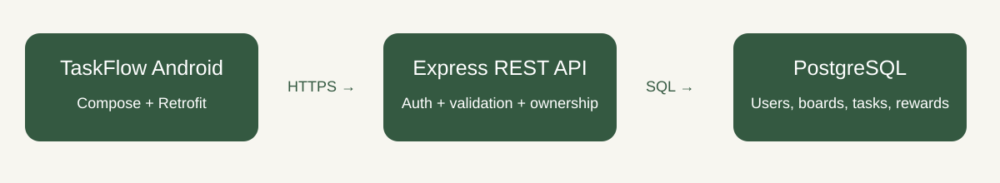

# TaskFlow — Part 2

**Student number: ST10461820**  
A Kotlin Android Kanban prototype based on the submitted TaskFlow Part 1 plan.

TaskFlow turns student work into manageable cards that move through **To-do → Doing → Done**. This Kotlin/Jetpack Compose prototype follows the supplied Part 1 plan.

## Submission status

Source, local Git history, automated tests, CI configuration and deployment setup are included. **GitHub publication, live hosting, physical-phone verification and a narrated video still require completion.** No account, hosted service or video has been fabricated. The full rubric was not supplied; check any lecturer requirements beyond the two screenshots.

## Demonstration video

Not recorded yet. Add your actual unlisted video URL here after recording on your phone. Use [the recording guide](docs/DEMO_SCRIPT.md).

## Features

| Area | Implemented behaviour |
|---|---|
| Accounts | Register, login, confirmation/validation, secure sessions and logout |
| Boards | Create, select, rename and delete personal boards |
| Tasks | Create/edit/view/delete, priority, description, due date, checklist and status |
| Kanban | Long-press dragging between visible columns and status buttons in details |
| Search | Case-insensitive title, priority and today/overdue filters |
| Settings | Name, system/light/dark theme, in-app reminders and default priority; persisted in database |
| Progress | Ten points per first completion, completed count, current streak and badges |
| Reminders | In-app due-date list for selected board, controlled by settings |
| Backend | Express REST API, PostgreSQL, validation and ownership checks |
| Quality | API/Kotlin tests, device UI test, GitHub Actions and safe logging |

**Final-PoE deferrals:** Google sign-in, offline Room/WorkManager sync, Firebase push and isiZulu/Afrikaans translations. Part 1 explicitly marks these PoE. Part 2 uses English and requires connectivity for saves. In-app reminders are not push notifications.

## Design and architecture

The board and four destinations (Board, Progress, Reminders, Settings) adapt Part 1. Neutral surfaces, green accents, Material controls, text priority labels and scrolling forms support readability. Columns scroll horizontally; drag to a visible neighbour or use details to select any status.

Compose screens use `TaskFlowViewModel` for state and asynchronous operations. Retrofit isolates HTTP. PostgreSQL is authoritative; saved state updates after API success. This intentionally reduces the planned offline-first Room design for Part 2. Account settings persist; search/current board are session UI state.

Tables: `users` (identity/hash/preferences), `sessions` (token digest/expiry), `boards` (owner/name), `tasks` (content/status/priority/date/checklist/timestamps), `completions` (unique task reward/user/day/points). Queries are parameterised and routes enforce ownership.

A task earns ten points only once, even after reopening/recompletion. Deletion preserves rewards. One SQL statement saves a completed task and awards its first reward atomically. Streaks count consecutive UTC days with first completions, permitting yesterday as the latest date. Badges: First Task, 10 Tasks Done and current 7-Day Streak. The streak badge reflects the current streak rather than a permanent historical achievement.

## Security and logging

Passwords use uniquely salted asynchronous scrypt hashes, not reversible encryption. HTTPS protects transit. The phone never saves passwords; it encrypts session tokens with AES-GCM/Android Keystore. The server stores token digests with seven-day expiry and revokes logout sessions. Authentication is rate-limited; input validation runs on client and server.

Release builds reject cleartext traffic. Debug HTTP supports local testing only; use HTTPS for hosting. Logs include operation/method/path/status/duration, excluding credentials, tokens and bodies. Android tag: `TaskFlow`. API errors avoid exposing database details.

## Run locally

1. Open this folder in Android Studio. Use JDK 17 or a compatible bundled JDK, SDK 35 and Build Tools 35.0.0. Gradle wrapper: 8.11.1.
2. Install Node.js 22+. In `server`, run `npm ci` then `npm start`.
3. Confirm `http://localhost:3000/health` returns success.
4. Run the app in an emulator; default API is `http://10.0.2.2:3000/`. Register your own account and create a board.
5. For an authorised USB phone: `adb reverse tcp:3000 tcp:3000`; set **Server connection** to `http://127.0.0.1:3000/`.

Without `DATABASE_URL`, development uses persistent PGlite (embedded PostgreSQL) under `server/data/`. This is local storage, not online hosting. Production requires `DATABASE_URL`. `local.properties`, secrets and database files are excluded from Git.

Follow [online setup](docs/SETUP_AND_SUBMISSION.md), then enter your deployed HTTPS root URL in Server connection. Register on that service; local data is separate. You can also build with `-PTASKFLOW_API_URL=https://YOUR-ACTUAL-SERVICE.onrender.com/` using your actual hostname. The debug APK is for assessment testing, not a signed Play Store release.

## API

JSON requests/responses; errors contain `error`. All `/api` routes except register/login require a bearer token. Deletion/logout return 204.

| Method | Path | Purpose |
|---|---|---|
| GET | `/health` | API/database readiness |
| POST | `/api/auth/register`, `/api/auth/login`, `/api/auth/logout` | Account/session management |
| GET / PUT | `/api/me` | Profile/preferences |
| GET / POST | `/api/boards` | List/create |
| PUT / DELETE | `/api/boards/:id` | Rename/delete |
| GET | `/api/boards/:id/tasks` | List tasks |
| POST | `/api/tasks` | Create task |
| PUT / DELETE | `/api/tasks/:id` | Update/delete |
| GET | `/api/stats` | Rewards |

Task JSON: existing `boardId` UUID, `title`, `description`, `status` (`TODO/DOING/DONE`), `priority` (`LOW/MEDIUM/HIGH`), nullable `dueDate` (`YYYY-MM-DD`) and `checklist` objects with `text`/`done`.

## Testing, Git and Actions

Run `npm test` in `server`. At root run `gradlew.bat testDebugUnitTest lintDebug assembleDebug` (Windows) or `./gradlew` with the same tasks. Device test: `connectedDebugAndroidTest`. [Observed results](docs/TESTING.md).

The local Git repository was initialised with a README and committed during implementation. No remote push occurred because an account/repository was unavailable. Continue meaningful commits/pushes after setup; do not fabricate earlier dates.

The workflow runs on push, pull request and manual dispatch. Jobs test the API, build/lint/test Android and run a Compose device test in an emulator. APKs/reports become artifacts. Configuration is not proof of a passing hosted run: verify Actions after publication.

## Submission checklist

- [ ] Publish GitHub repository and verify all Actions jobs.
- [ ] Deploy API/PostgreSQL and verify HTTPS/persistence.
- [ ] Test hosted app on a physical Android phone.
- [ ] Add real screenshots; current image is an original diagram.
- [ ] Record narrated phone video including API/database evidence; add URL above.
- [ ] Review [AI disclosure](docs/AI_USAGE.md), understand code and customise this report.
- [ ] Submit GitHub/video links. **No ZIP submissions.**

## References

Project code was generated with AI assistance, not represented as copied tutorial code. Comments explain networking/security/ownership/rewards. Consulted 21 September 2026:

- [Android build compatibility](https://developer.android.com/build/releases/agp-8-9-0-release-notes)
- [Compose testing](https://developer.android.com/develop/ui/compose/testing)
- [Retrofit](https://github.com/square/retrofit)
- [Node cryptography](https://nodejs.org/api/crypto.html)
- [Render deployment](https://render.com/docs/deploy-node-express-app), [PostgreSQL](https://render.com/docs/postgresql-creating-connecting), [free-tier limits](https://render.com/docs/free)
- Supplied TaskFlow Planning and Design Document — Part 1, ST10461820.

Dependencies retain their respective licences. See AI disclosure for generated work.
